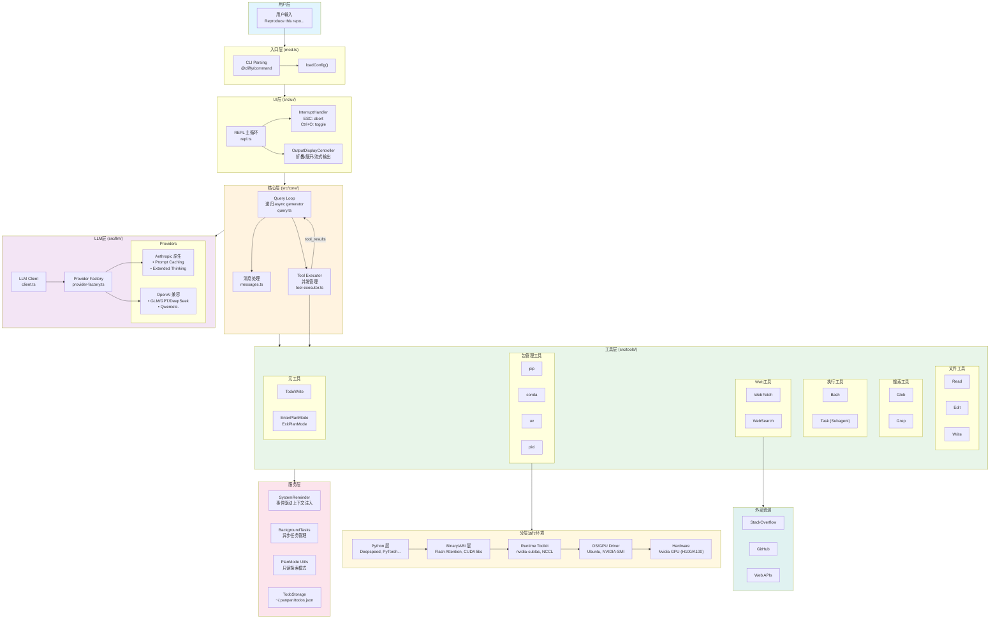

```mermaid
flowchart TB
    subgraph mod["mod.ts (入口)"]
        mod_main["main()<br/>CLI定义 + 参数解析"]
    end

    subgraph config["src/config/"]
        config_ts["config.ts<br/>• loadConfig()<br/>• 环境变量优先级<br/>• 默认值处理"]
    end

    subgraph types["src/types/"]
        tool_ts["tool.ts<br/>• Tool interface<br/>• ToolContext<br/>• ToolYield types"]
        message_ts["message.ts<br/>• ContentBlock types<br/>• Message types<br/>• TokenUsage"]
        llm_ts["llm.ts<br/>• LLMConfig<br/>• ChatMessage<br/>• ToolDefinition"]
        provider_ts["provider.ts<br/>• ProviderType enum<br/>• InternalMessage<br/>• CompletionRequest"]
        todo_ts["todo.ts<br/>• TodoItem<br/>• TodoStatus"]
    end

    subgraph ui["src/ui/"]
        repl_ts["repl.ts<br/>• runREPL() 主循环<br/>• InterruptHandler 类<br/>• /commands 处理<br/>• 交互/管道模式检测"]
        output_ts["output-display.ts<br/>• OutputDisplayController<br/>• Folded/Expanded 切换<br/>• 100行缓冲区<br/>• 10fps 渲染循环"]
        render_ts["render.ts<br/>• 消息格式化<br/>• ANSI颜色<br/>• Token统计显示"]
    end

    subgraph core["src/core/"]
        query_ts["query.ts<br/>• query() 递归生成器<br/>• normalizeMessagesForAPI()<br/>• 中断检查点<br/>• System prompt 组装"]
        executor_ts["tool-executor.ts<br/>• ToolExecutor 类<br/>• QueueEntry 队列<br/>• canExecute() 并发判断<br/>• processQueue() 执行循环"]
        messages_ts["messages.ts<br/>• createUserMessage()<br/>• 消息标准化<br/>• 孤立tool_use清理"]
    end

    subgraph llm["src/llm/"]
        client_ts["client.ts<br/>• LLMClient 类<br/>• complete() 方法<br/>• 统一接口"]
        factory_ts["provider-factory.ts<br/>• createProvider()<br/>• detectProviderType()<br/>• 模型名匹配"]
        stream_ts["stream-parser.ts<br/>• SSE 流解析<br/>• 增量内容处理"]

        subgraph providers["providers/"]
            anthropic_ts["anthropic.ts<br/>• AnthropicProvider<br/>• Prompt caching 实现<br/>• Extended thinking<br/>• cache_control 标记"]
            openai_ts["openai.ts<br/>• OpenAIProvider<br/>• 通用兼容API<br/>• 消息格式转换"]
        end
    end

    subgraph tools["src/tools/"]
        tools_mod["mod.ts<br/>• getAllTools()<br/>• 工具注册表"]

        bash_ts["bash.ts<br/>• BashTool<br/>• 命令执行<br/>• 输出截断"]

        file_read["file-read.ts<br/>• ReadTool<br/>• 行号显示<br/>• 大文件分页"]
        file_edit["file-edit.ts<br/>• EditTool<br/>• 精确字符串替换<br/>• replace_all 模式"]
        file_write["file-write.ts<br/>• WriteTool<br/>• 文件覆盖<br/>• 读取前置检查"]

        glob_ts["glob.ts<br/>• GlobTool<br/>• 模式匹配<br/>• 修改时间排序"]
        grep_ts["grep.ts<br/>• GrepTool<br/>• ripgrep 封装<br/>• 多种输出模式"]

        task_ts["task.ts<br/>• TaskTool<br/>• 子代理生成<br/>• 工具过滤<br/>• 后台执行支持"]
        task_output["task-output.ts<br/>• TaskOutputTool<br/>• 后台任务查询"]

        todo_ts2["todo-write.ts<br/>• TodoWriteTool<br/>• 任务列表更新"]

        plan_enter["enter-plan-mode.ts<br/>• EnterPlanModeTool<br/>• 创建plan文件"]
        plan_exit["exit-plan-mode.ts<br/>• ExitPlanModeTool<br/>• 验证并退出"]

        web_fetch["web-fetch.ts<br/>• WebFetchTool<br/>• Playwright stealth<br/>• SSRF 防护<br/>• Readability 提取"]
        web_search["web-search.ts<br/>• WebSearchTool<br/>• 搜索API调用"]

        dataset["dataset-download.ts<br/>• DatasetDownloadTool<br/>• 两阶段下载<br/>• 后台任务"]

        lsp_ts["lsp.ts<br/>• LSPTool<br/>• Language Server"]

        subgraph pkg_managers["package-managers/"]
            common_ts["common.ts<br/>• executeCommandStreaming()<br/>• 自适应超时常量<br/>• 环境命令构建"]
            pip_ts["pip.ts<br/>• PipTool (10min)"]
            conda_ts["conda.ts<br/>• CondaTool (15min)"]
            uv_ts["uv.ts<br/>• UVTool (5min)<br/>• venv命名验证"]
            pixi_ts["pixi.ts<br/>• PixiTool (5min)"]
        end
    end

    subgraph services["src/services/"]
        reminder_ts["system-reminder.ts<br/>• SystemReminderService<br/>• 事件监听器Map<br/>• 提醒生成逻辑<br/>• 防重复机制"]
    end

    subgraph utils["src/utils/"]
        plan_mode["plan-mode.ts<br/>• planModeEnabled 状态<br/>• planFilePath 管理<br/>• 工具限制检查<br/>• plan文件命名"]
        todo_storage["todo-storage.ts<br/>• TodoStorage 类<br/>• 内存缓存(5s TTL)<br/>• JSON 持久化<br/>• ID重用机制"]
        bg_tasks["background-tasks.ts<br/>• BackgroundTaskRuntime<br/>• 任务生命周期<br/>• abort支持<br/>• 状态查询"]
        browser_mgr["browser-manager.ts<br/>• Playwright 管理<br/>• 浏览器生命周期"]
        stealth["stealth-scripts.ts<br/>• 反检测脚本<br/>• WebDriver隐藏"]
        agent_loader["agent-loader.ts<br/>• 子代理配置加载<br/>• 类型定义"]
        cwd_ts["cwd.ts<br/>• 工作目录管理"]
    end

    %% 主要依赖关系
    mod_main --> config_ts
    mod_main --> repl_ts

    repl_ts --> query_ts
    repl_ts --> output_ts
    repl_ts --> render_ts

    query_ts --> client_ts
    query_ts --> executor_ts
    query_ts --> messages_ts
    query_ts --> reminder_ts
    query_ts --> plan_mode

    client_ts --> factory_ts
    factory_ts --> anthropic_ts
    factory_ts --> openai_ts
    anthropic_ts --> stream_ts
    openai_ts --> stream_ts

    executor_ts --> tools_mod

    task_ts --> agent_loader
    task_ts --> bg_tasks
    task_output --> bg_tasks

    todo_ts2 --> todo_storage

    plan_enter --> plan_mode
    plan_exit --> plan_mode

    web_fetch --> browser_mgr
    web_fetch --> stealth

    dataset --> bg_tasks

    pip_ts --> common_ts
    conda_ts --> common_ts
    uv_ts --> common_ts
    pixi_ts --> common_ts

    style mod fill:#e3f2fd
    style config fill:#e3f2fd
    style types fill:#f3e5f5
    style ui fill:#e8f5e9
    style core fill:#fff3e0
    style llm fill:#fce4ec
    style tools fill:#e0f7fa
    style services fill:#fff8e1
    style utils fill:#f1f8e9
```

```mermaid
flowchart TB
    subgraph Entry["入口"]
        mod_ts["mod.ts"]
    end

    subgraph Config["配置"]
        config_config["config/config.ts"]
    end

    subgraph Types["类型定义"]
        types_tool["types/tool.ts"]
        types_message["types/message.ts"]
        types_llm["types/llm.ts"]
        types_provider["types/provider.ts"]
        types_todo["types/todo.ts"]
        types_agent["types/agent.ts"]
    end

    subgraph UI["用户界面"]
        ui_repl["ui/repl.ts"]
        ui_output["ui/output-display.ts"]
        ui_render["ui/render.ts"]
    end

    subgraph Core["核心"]
        core_query["core/query.ts"]
        core_executor["core/tool-executor.ts"]
        core_messages["core/messages.ts"]
    end

    subgraph LLM["LLM客户端"]
        llm_client["llm/client.ts"]
        llm_factory["llm/provider-factory.ts"]
        llm_stream["llm/stream-parser.ts"]
        llm_anthropic["llm/providers/anthropic.ts"]
        llm_openai["llm/providers/openai.ts"]
    end

    subgraph Tools["工具"]
        tools_mod["tools/mod.ts"]
        tools_bash["tools/bash.ts"]
        tools_read["tools/file-read.ts"]
        tools_edit["tools/file-edit.ts"]
        tools_write["tools/file-write.ts"]
        tools_glob["tools/glob.ts"]
        tools_grep["tools/grep.ts"]
        tools_task["tools/task.ts"]
        tools_task_out["tools/task-output.ts"]
        tools_todo["tools/todo-write.ts"]
        tools_plan_enter["tools/enter-plan-mode.ts"]
        tools_plan_exit["tools/exit-plan-mode.ts"]
        tools_webfetch["tools/web-fetch.ts"]
        tools_websearch["tools/web-search.ts"]
        tools_dataset["tools/dataset-download.ts"]
        tools_lsp["tools/lsp.ts"]

        subgraph PkgMgr["包管理器"]
            pkg_mod["package-managers/mod.ts"]
            pkg_common["package-managers/common.ts"]
            pkg_pip["package-managers/pip.ts"]
            pkg_conda["package-managers/conda.ts"]
            pkg_uv["package-managers/uv.ts"]
            pkg_pixi["package-managers/pixi.ts"]
        end
    end

    subgraph Services["服务"]
        svc_reminder["services/system-reminder.ts"]
    end

    subgraph Utils["工具函数"]
        utils_plan["utils/plan-mode.ts"]
        utils_todo["utils/todo-storage.ts"]
        utils_bg["utils/background-tasks.ts"]
        utils_browser["utils/browser-manager.ts"]
        utils_stealth["utils/stealth-scripts.ts"]
        utils_agent["utils/agent-loader.ts"]
        utils_cwd["utils/cwd.ts"]
    end

    %% Entry dependencies
    mod_ts --> config_config
    mod_ts --> ui_repl
    mod_ts --> types_llm

    %% UI dependencies
    ui_repl --> core_query
    ui_repl --> ui_output
    ui_repl --> ui_render
    ui_repl --> llm_client
    ui_repl --> tools_mod
    ui_repl --> types_message
    ui_repl --> utils_todo
    ui_repl --> utils_plan

    ui_output --> types_tool
    ui_render --> types_message

    %% Core dependencies
    core_query --> core_messages
    core_query --> core_executor
    core_query --> llm_client
    core_query --> svc_reminder
    core_query --> utils_plan
    core_query --> types_message
    core_query --> types_tool

    core_executor --> tools_mod
    core_executor --> types_tool
    core_executor --> types_message
    core_executor --> utils_plan
    core_executor --> svc_reminder

    core_messages --> types_message

    %% LLM dependencies
    llm_client --> llm_factory
    llm_client --> types_llm
    llm_client --> types_provider

    llm_factory --> llm_anthropic
    llm_factory --> llm_openai
    llm_factory --> types_provider

    llm_anthropic --> llm_stream
    llm_anthropic --> types_provider
    llm_anthropic --> types_llm

    llm_openai --> llm_stream
    llm_openai --> types_provider
    llm_openai --> types_llm

    %% Tools registry
    tools_mod --> tools_bash
    tools_mod --> tools_read
    tools_mod --> tools_edit
    tools_mod --> tools_write
    tools_mod --> tools_glob
    tools_mod --> tools_grep
    tools_mod --> tools_task
    tools_mod --> tools_task_out
    tools_mod --> tools_todo
    tools_mod --> tools_plan_enter
    tools_mod --> tools_plan_exit
    tools_mod --> tools_webfetch
    tools_mod --> tools_websearch
    tools_mod --> tools_dataset
    tools_mod --> tools_lsp
    tools_mod --> pkg_mod

    %% Tool type dependencies
    tools_bash --> types_tool
    tools_read --> types_tool
    tools_edit --> types_tool
    tools_write --> types_tool
    tools_glob --> types_tool
    tools_grep --> types_tool
    tools_task --> types_tool
    tools_task --> utils_agent
    tools_task --> utils_bg
    tools_task --> core_query
    tools_task_out --> types_tool
    tools_task_out --> utils_bg
    tools_todo --> types_tool
    tools_todo --> utils_todo
    tools_todo --> svc_reminder
    tools_plan_enter --> types_tool
    tools_plan_enter --> utils_plan
    tools_plan_exit --> types_tool
    tools_plan_exit --> utils_plan
    tools_webfetch --> types_tool
    tools_webfetch --> utils_browser
    tools_webfetch --> utils_stealth
    tools_websearch --> types_tool
    tools_dataset --> types_tool
    tools_dataset --> utils_bg
    tools_lsp --> types_tool

    %% Package manager dependencies
    pkg_mod --> pkg_pip
    pkg_mod --> pkg_conda
    pkg_mod --> pkg_uv
    pkg_mod --> pkg_pixi

    pkg_pip --> pkg_common
    pkg_pip --> types_tool
    pkg_conda --> pkg_common
    pkg_conda --> types_tool
    pkg_uv --> pkg_common
    pkg_uv --> types_tool
    pkg_pixi --> pkg_common
    pkg_pixi --> types_tool

    pkg_common --> types_tool

    %% Services dependencies
    svc_reminder --> types_todo
    svc_reminder --> utils_todo

    %% Utils dependencies
    utils_todo --> types_todo
    utils_agent --> types_agent
    utils_browser --> utils_stealth

    %% Type cross-references
    types_tool --> types_message
    types_provider --> types_message
    types_provider --> types_llm

    style Entry fill:#e3f2fd
    style Config fill:#e3f2fd
    style Types fill:#f3e5f5
    style UI fill:#e8f5e9
    style Core fill:#fff3e0
    style LLM fill:#fce4ec
    style Tools fill:#e0f7fa
    style Services fill:#fff8e1
    style Utils fill:#f1f8e9
```

# panpan 架构文档

本文档包含三张架构图（Mermaid 代码 + 详细文字描述），用于准确反映 panpan 的当前架构。

---

## 架构演进总结

### 原始架构 (Agent PANDA)
- 线性流程: User request + System instructions + History → LLM → Success/Fail 循环
- Docker/tmux 沙箱隔离
- 分层环境概念 (Python → Binary → Runtime → OS → Hardware)
- 规划中的外部搜索 (Stackoverflow, Github)

### 当前架构 (panpan) 主要变化
1. **核心循环**: 从 Success/Fail 判断 → 递归 async generator
2. **LLM**: 单一 → 多 Provider (Anthropic 原生 + OpenAI 兼容)
3. **执行环境**: Docker 沙箱 → 本地工具 + 智能并发
4. **新功能**: Plan Mode, Subagent, Todo, System Reminder, 流式输出

---

## 图一：高层概览图

### Mermaid 代码



### 文字描述

**高层概览图展示 panpan 的六层架构：**

1. **用户层** → **入口层**: 用户输入通过 CLI 解析，加载配置
2. **入口层** → **UI层**: 启动 REPL 主循环，处理中断和输出显示
3. **UI层** → **核心层**: REPL 调用 Query Loop（递归 async generator）
4. **核心层** ↔ **LLM层**: Query Loop 调用 LLM Client，Provider Factory 自动选择 Anthropic/OpenAI
5. **核心层** → **工具层**: Tool Executor 执行工具，支持并发（只读）和串行（修改）
6. **工具层** → **服务层**: 工具依赖各种服务（Todo存储、后台任务、Plan模式等）

**关键数据流：**
- 递归循环：`Query Loop → LLM → tool_use → Executor → tool_results → Query Loop`
- 中断传播：`InterruptHandler → AbortController → 所有组件`

**保留的分层环境概念：**
- 包管理工具（pip/conda/uv/pixi）操作的目标是分层运行环境
- 从 Python 依赖到硬件驱动的完整栈

**绘图要点：**
- 使用 6 个主要区块（用户、入口、UI、核心、LLM、工具）+ 3 个辅助区块（服务、环境、外部）
- 核心层的 Query Loop 和 Tool Executor 之间有双向箭头（递归循环）
- 分层环境保持原图的垂直栈结构
- 建议使用不同颜色区分各层（参考 style 定义的颜色）

---

## 图二：模块级详细图

### Mermaid 代码



### 文字描述

**模块级详细图展示每个目录下的核心文件：**

**入口和配置 (mod.ts, src/config/)**
- `mod.ts`: CLI 入口，使用 @cliffy/command 解析参数
- `config.ts`: 配置加载，支持 CLI > 环境变量 > 默认值 优先级

**类型系统 (src/types/)**
- `tool.ts`: Tool 接口定义，ToolContext（执行上下文），ToolYield（生成器输出类型）
- `message.ts`: ContentBlock（text/thinking/tool_use/tool_result），Message 联合类型
- `llm.ts`: LLM 配置和 API 类型
- `provider.ts`: Provider 内部类型
- `todo.ts`: Todo 项目类型

**UI层 (src/ui/)**
- `repl.ts`: REPL 主循环，InterruptHandler（ESC/Ctrl+O），/命令处理
- `output-display.ts`: 流式输出控制器，折叠/展开切换，100行缓冲区
- `render.ts`: 消息格式化和 ANSI 颜色

**核心层 (src/core/)**
- `query.ts`: 递归 async generator，消息标准化，中断检查点
- `tool-executor.ts`: 工具执行器，并发队列管理，canExecute() 判断
- `messages.ts`: 消息创建和清理

**LLM层 (src/llm/)**
- `client.ts`: 统一 LLM 客户端接口
- `provider-factory.ts`: Provider 自动检测（claude-* → Anthropic，其他 → OpenAI）
- `stream-parser.ts`: SSE 流解析
- `providers/anthropic.ts`: Anthropic 原生 API（Prompt Caching + Extended Thinking）
- `providers/openai.ts`: OpenAI 兼容 API

**工具层 (src/tools/)**
- 文件工具: `file-read.ts`, `file-edit.ts`, `file-write.ts`
- 搜索工具: `glob.ts`, `grep.ts`
- 执行工具: `bash.ts`
- 任务工具: `task.ts`（子代理），`task-output.ts`（后台任务查询），`todo-write.ts`
- Plan模式: `enter-plan-mode.ts`, `exit-plan-mode.ts`
- Web工具: `web-fetch.ts`（Playwright + Stealth），`web-search.ts`
- 数据集: `dataset-download.ts`（两阶段下载）
- LSP: `lsp.ts`
- 包管理: `package-managers/common.ts`（流式执行 + 自适应超时），`pip.ts/conda.ts/uv.ts/pixi.ts`

**服务层 (src/services/)**
- `system-reminder.ts`: 事件驱动的上下文注入服务

**工具层 (src/utils/)**
- `plan-mode.ts`: Plan 模式状态和工具限制
- `todo-storage.ts`: Todo 持久化（~/.panpan/todos.json）
- `background-tasks.ts`: 后台任务管理
- `browser-manager.ts`: Playwright 生命周期
- `stealth-scripts.ts`: 反检测脚本
- `agent-loader.ts`: 子代理配置
- `cwd.ts`: 工作目录管理

**绘图要点：**
- 每个文件节点显示文件名 + 3-4 个关键职责
- 用箭头表示主要依赖关系
- 工具层内部按功能分组（文件、搜索、执行、Web、包管理）
- 包管理器单独分组，显示各自的超时时间

---

## 图三：完整依赖图

### Mermaid 代码



### 文字描述

**完整依赖图展示所有文件间的 import 关系：**

**依赖层次（从上到下）：**

1. **入口层**
   - `mod.ts` → `config/config.ts`, `ui/repl.ts`, `types/llm.ts`

2. **UI层**
   - `ui/repl.ts` → `core/query.ts`, `ui/output-display.ts`, `ui/render.ts`, `llm/client.ts`, `tools/mod.ts`, `utils/todo-storage.ts`, `utils/plan-mode.ts`
   - `ui/output-display.ts` → `types/tool.ts`
   - `ui/render.ts` → `types/message.ts`

3. **核心层**
   - `core/query.ts` → `core/messages.ts`, `core/tool-executor.ts`, `llm/client.ts`, `services/system-reminder.ts`, `utils/plan-mode.ts`
   - `core/tool-executor.ts` → `tools/mod.ts`, `utils/plan-mode.ts`, `services/system-reminder.ts`
   - `core/messages.ts` → `types/message.ts`

4. **LLM层**
   - `llm/client.ts` → `llm/provider-factory.ts`
   - `llm/provider-factory.ts` → `llm/providers/anthropic.ts`, `llm/providers/openai.ts`
   - `llm/providers/*` → `llm/stream-parser.ts`

5. **工具层**
   - `tools/mod.ts` → 所有工具文件
   - 所有工具 → `types/tool.ts`
   - 特殊依赖：
     - `tools/task.ts` → `utils/agent-loader.ts`, `utils/background-tasks.ts`, `core/query.ts`（递归调用）
     - `tools/todo-write.ts` → `utils/todo-storage.ts`, `services/system-reminder.ts`
     - `tools/web-fetch.ts` → `utils/browser-manager.ts`, `utils/stealth-scripts.ts`
     - `tools/dataset-download.ts` → `utils/background-tasks.ts`
     - `tools/enter-plan-mode.ts`, `tools/exit-plan-mode.ts` → `utils/plan-mode.ts`
     - `package-managers/*.ts` → `package-managers/common.ts`

6. **服务层**
   - `services/system-reminder.ts` → `utils/todo-storage.ts`, `types/todo.ts`

7. **工具函数层**
   - `utils/browser-manager.ts` → `utils/stealth-scripts.ts`
   - `utils/agent-loader.ts` → `types/agent.ts`
   - `utils/todo-storage.ts` → `types/todo.ts`

8. **类型层**（被广泛依赖）
   - `types/tool.ts` → `types/message.ts`
   - `types/provider.ts` → `types/message.ts`, `types/llm.ts`

**关键循环依赖：**
- `tools/task.ts` → `core/query.ts`（子代理通过递归调用 query 实现）
- 这是有意设计，不是问题

**绘图要点：**
- 使用简化的节点名（只显示文件名）
- 箭头表示 import 关系
- 特别标注 task.ts → query.ts 的循环依赖
- 类型文件被多个模块依赖，可以放在底层

---

## 数据流详解

### 完整请求流程

```
1. 用户输入 "fix bug in main.ts"
   ↓
2. REPL 创建 UserMessage
   ↓
3. query() 调用 LLM
   ├─► normalizeMessagesForAPI() 转换消息
   ├─► 添加 plan mode 提示 (如果激活)
   ├─► 添加 system reminders (基于事件)
   └─► llmClient.complete() 调用 provider
   ↓
4. LLM 返回 AssistantMessage 包含 tool_use
   ├─► yield AssistantMessage (显示给用户)
   └─► 提取 tool_use blocks
   ↓
5. ToolExecutor.executeAll()
   ├─► 构建执行队列 (QueueEntry[])
   ├─► 并发执行安全工具 (Read, Glob, Grep)
   ├─► 串行执行不安全工具 (Edit, Write, Bash)
   └─► yield tool_result messages
   ↓
6. 递归调用 query() 带所有消息
   ├─► LLM 看到 tool_result
   ├─► 返回最终响应 (text)
   └─► yield 最终 AssistantMessage
   ↓
7. REPL 显示结果
```

### 并发执行示例

```
LLM 请求: [Read file1, Read file2, Glob *.ts, Edit main.ts]
  ↓
Queue: [
  { id: 1, tool: Read, safe: true },
  { id: 2, tool: Read, safe: true },
  { id: 3, tool: Glob, safe: true },
  { id: 4, tool: Edit, safe: false }
]
  ↓
执行顺序:
  1. 并发启动: Read(1), Read(2), Glob(3)
  2. 等待所有完成
  3. 串行执行: Edit(4)
  ↓
按 ID 顺序 yield 结果 (1→2→3→4)
```

### 中断处理流程

```
用户按 ESC
  ↓
InterruptHandler 检测 byte 27
  ↓
abortController.abort()
  ↓
影响所有组件:
  ├─► query() 在检查点返回
  ├─► ToolExecutor 停止启动新工具
  ├─► 当前工具收到 signal.aborted
  └─► outputDisplay.stop()
  ↓
显示 "[Interrupted]"
```

---

## 模块职责对照表

| 原始概念 | 当前实现 | 说明 |
|---------|---------|------|
| User request | UserMessage | 消息类型系统 |
| System instructions | systemPrompt + SystemReminder | 分层提示注入 |
| History cmd output pairs | Message[] (ContentBlock[]) | 结构化消息历史 |
| LLM Thinking | AssistantMessage + ThinkingBlock | 支持 extended thinking |
| Success/Fail loop | Recursive query() | 自动多轮工具调用 |
| Docker container | Local tools + Bash | 无容器化隔离 |
| tmux virtual env | Package manager tools | pip/conda/uv/pixi |
| Stackoverflow/Github search | WebFetch, WebSearch | 已实现 |
| Layered environments | 分层环境框（概念保留） | 包管理器操作目标 |
